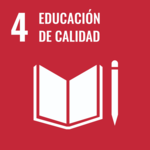
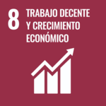
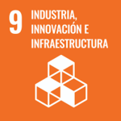
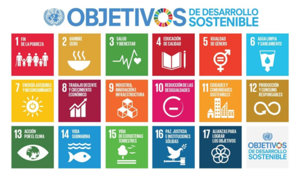

# Introducción a la Sostenibilidad

Para mi la sostenibilidad es el conjunto de acciones o medidas que se pueden aplicar para ayudar al medioambiente, la sociedad o la economía, mientras que se permite una buena calidad de vida sin afectar a la calidad de vida de las próximas generaciones. 

Indagando más en cada uno de los pilares de la sostenibilidad: 
- Pilar ambiental: Se basa en la gestión adecuada de recursos, el control de los residuos medioambientales, minimización de residuos, etc... 
- Pilar social: Se basa en garantizar una serie de características (buena calidad de vida) a toos los ciudadanos sin perjudicar a los ciudadanos futuros, en este pilar se encuentran la inclusión, la igualdad de oportunidades, derechos y deberes igualitarios, etc... 
- Pilar económico: Se basa en mantener el crecimiento económico sin agotar los recursos o perjudicar a los otros dos pilares de la sostenibilidad y sin comprometer a futuras genercaciones, todo esto mediante el uso de prácticas éticas, responsables y equitativas. 

>Lo que le hacemos al mundo, nos lo hacemos a nosotros mismos. – Mahatma Gandhi

| Nombre de ODS | Imagen de ODS | Relación con la informática |
| ------------- | ------------- | --------------------------- |
| Educación de calidad |  | Permitir a los ciudadanos el acceso económico a herramientas importantes tales como ordenadores, portátiles o similares para facilitar la enseñanza. |
| Trabajo decente y crecimiento economico |  | Dentro del campo de la informática existen muchos puesto de trabajo que permiten el crecimiento económico. |
| Industria, innovacion e infraestructura |  | Creación de infraestucturas sostenibles y menos contanimantes con el uso de nuevas tecnologías. |

## Objetivos de desarrollo sostenible (ODS)

